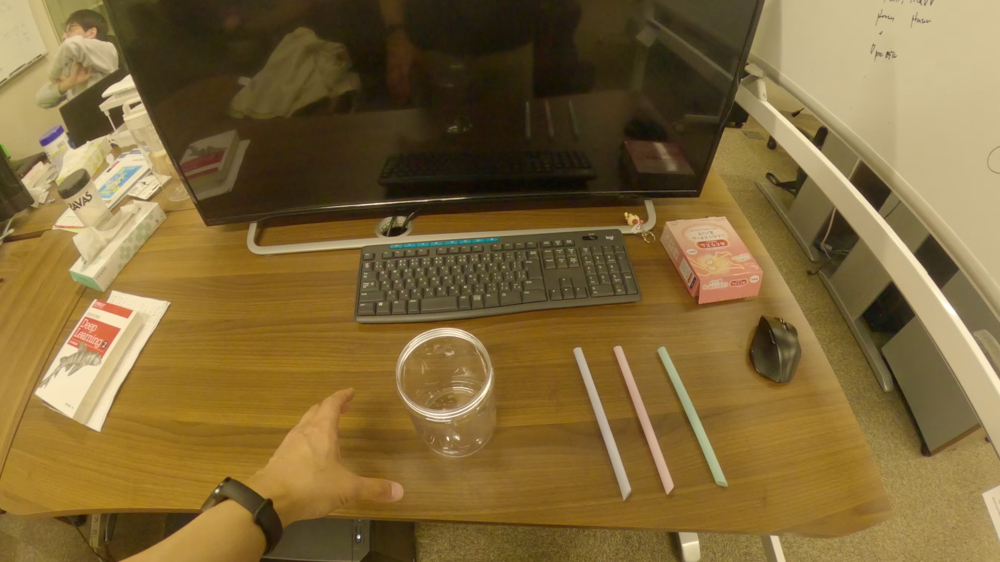
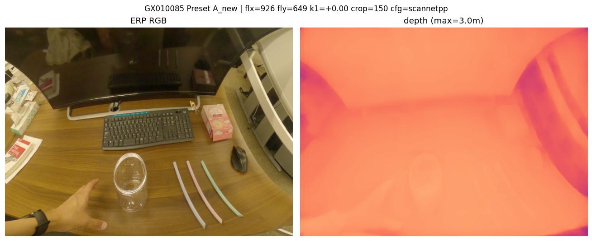
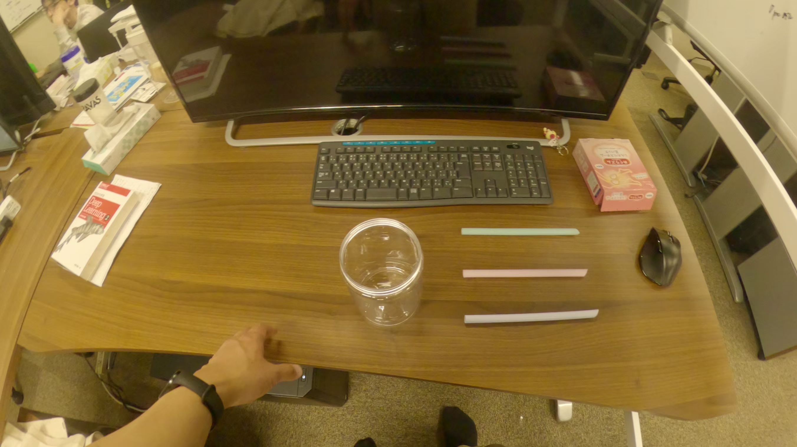
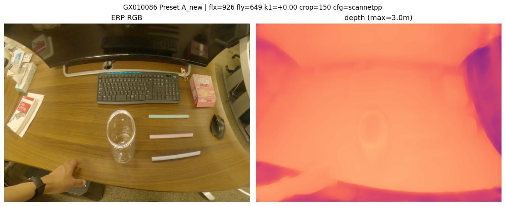
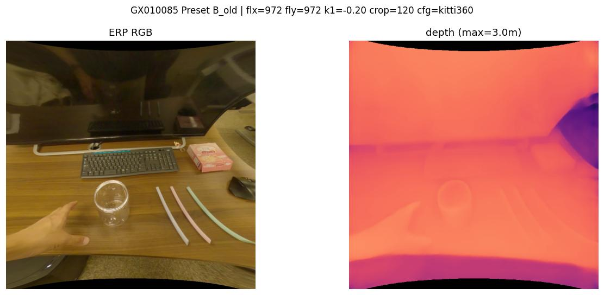
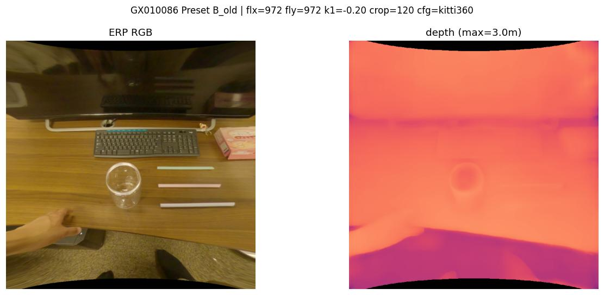

# Camera parameter presets for GoPro Hero 11 + Max Lens video inference

`fl_x`, `fl_y` scale linearly with image width `W` (REF_W = 5312 = GoPro 5.3K native).

## Comparison table

| field | **Preset A — "new params" (current default)** | Preset B — "old params" (original 32-video batch) |
|---|---|---|
| status | **active in `demo/demo_video.py`** | legacy |
| camera_model | OPENCV_FISHEYE | OPENCV_FISHEYE |
| fl_x | `1820 × W/5312` (anisotropic) | `1909 × W/5312` (isotropic) |
| fl_y | `1275 × W/5312` (anisotropic) | `1909 × W/5312` (isotropic) |
| k1 | 0.0 | -0.20 |
| k2, k3, k4 | 0, 0, 0 | 0, 0, 0 |
| crop_wFoV | 150 | 120 |
| fwd_sz (H, W) | (512, 704) | (704, 704) |
| config | scannetpp indoor | kitti360 outdoor |
| depth_max (visualization) | 3.0 m | 3.0 m |
| tuned for | GoPro Hero 11 + Max Lens + **HyperView** (8:7 → 16:9 stretch) | Max Lens isotropic assumption (incorrect for HyperView) |
| tuned on | `sweep_GX010086_lowfly` (GX010086 frame 0) | `grid_search_cam_params.py` on 640×360 episode_000204 |
| output dir | `demo/output/new_presetA/` | `demo/output/new_presetB/` (new videos) / `demo/output/old32_presetB/` (original 32) |

Filename pattern: `{video}_depth.mp4` (depth_max=8 for Preset A initial run, depth_max=3 for `_depth_dmax3.mp4`) and `{video}_depth_raw.npz` (uint16 millimeters).

---

## Preset A — current default

Input frame 0 → ERP RGB + depth (depth_max=3 m):

### GX010085

### GX010086

---

## Preset B — old params (for comparison)

### GX010085

### GX010086

